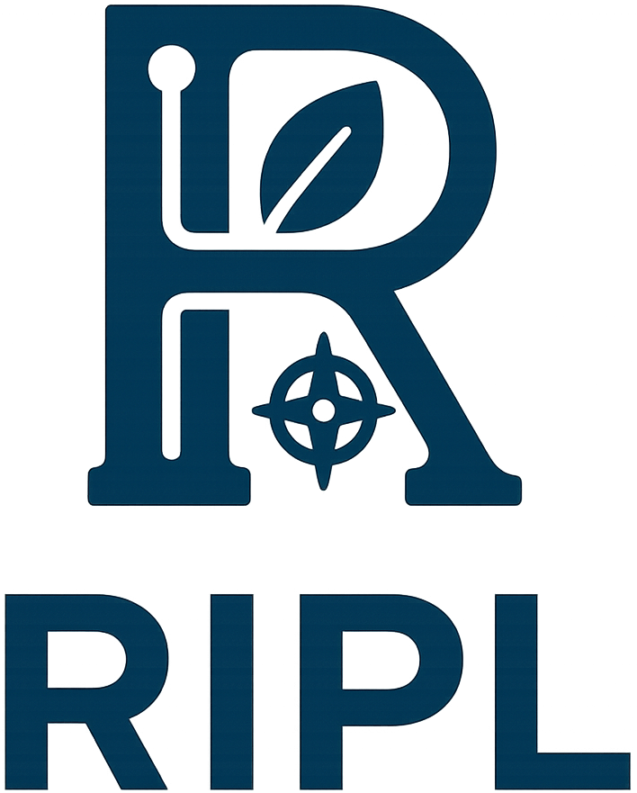
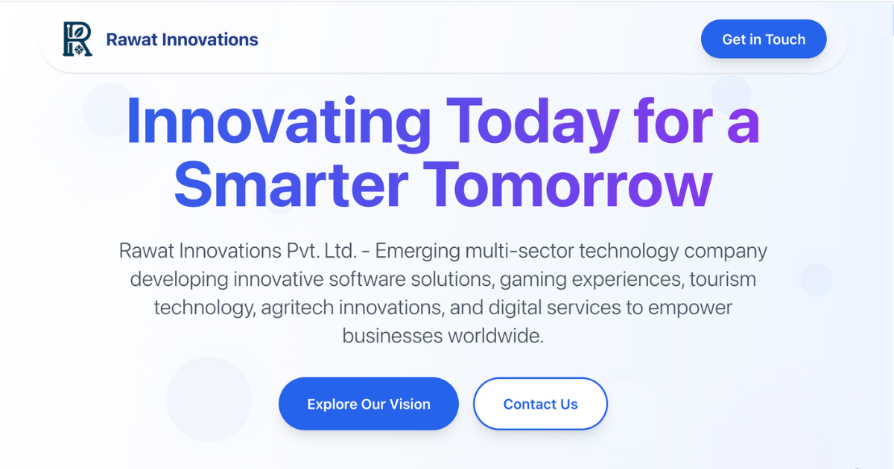

# Rawat Innovations Pvt. Ltd.




**🌐 Live Website:** [https://rawatinnovations.com](https://rawatinnovations.com)

Welcome to the official website repository of Rawat Innovations Pvt. Ltd., an emerging multi-sector technology company founded in 2025. We specialize in developing innovative software solutions, gaming experiences, tourism technology, agritech innovations, and digital services to empower businesses worldwide.

## Table of Contents

- [About Us](#about-us)
- [Our Sectors](#our-sectors)
- [Vision & Projects](#vision--projects)
- [Key Features](#key-features)
- [Getting Started](#getting-started)
- [Available Scripts](#available-scripts)
- [Tech Stack](#tech-stack)
- [Project Structure](#project-structure)
- [Environment Variables](#environment-variables)
- [Performance](#performance)
- [Screenshots](#screenshots)
- [Roadmap](#roadmap)
- [Contributing](#contributing)
- [Contact](#contact)
- [Legal](#legal)
- [Acknowledgments](#acknowledgments)
- [Learn More](#learn-more)

## About Us

Rawat Innovations is committed to bridging innovative technology with real-world business needs. Our mission is to democratize innovation through advanced software development, gaming technology, tourism tech solutions, agritech innovations, and comprehensive digital services that solve real-world business challenges across multiple industries.

## Our Sectors

- **LocalBizLabs**: Professional web development agency specializing in modern websites, e-commerce platforms, and digital solutions for local businesses. [Visit LocalBizLabs →](https://localbizlabs.com)
- **Software Development**: Custom applications, SaaS platforms, and enterprise solutions built with modern technologies.
- **Game Design**: Immersive gaming experiences for mobile, desktop, and console platforms via WinitStudios. [Visit WinitStudios →](https://winitstudios.com)
- **Tourism-Tech**: Smart travel solutions promoting culture and enhancing accessibility worldwide. *(Coming Soon)*
- **Digital Services**: Branding, consulting, content creation, and comprehensive digital transformation. *(Coming Soon)*
- **AgriTech Innovation**: IoT-powered agriculture solutions, AI tools, and rural empowerment initiatives. *(Coming Soon)*

## Vision & Projects

We're currently building the foundation for groundbreaking innovations across multiple sectors:

- **Nearby Connect**: Location-based discovery social media app
- **AI-Powered Analytics Platform**: Machine learning for business intelligence
- **Immersive VR Training**: Virtual reality training solutions
- **Smart Tourism App**: AI-driven travel companion
- **Sustainable Fashion Platform**: Eco-friendly apparel marketplace
- **IoT Agriculture Network**: Connected farming solutions

## Key Features

✨ **Modern & Responsive Design**

- Fully responsive across all devices (mobile, tablet, desktop)
- Touch gesture support for mobile navigation
- Smooth scroll animations

🎯 **Performance Optimized**

- Next.js 15 with App Router for optimal performance
- Image optimization with Next.js Image component
- Code splitting and lazy loading

♿ **Accessibility First**

- WCAG 2.1 compliant
- Keyboard navigation support
- Screen reader optimized
- Skip navigation links
- Proper ARIA labels and semantic HTML

🔍 **SEO Optimized**

- Dynamic sitemap generation
- Meta tags and Open Graph support
- Semantic HTML structure
- Fast page load times

🎨 **Engaging Animations**

- Framer Motion animations
- Interactive floating elements
- Smooth transitions and micro-interactions

## Getting Started

This is a [Next.js](https://nextjs.org) project built with TypeScript, Tailwind CSS, and Framer Motion.

### Prerequisites

- Node.js 18.x or later
- npm, yarn, pnpm, or bun

### Installation

1. Clone the repository:

   ```bash
   git clone https://github.com/vineet-codes256/rawat-innovations-page.git
   cd rawat-innovations-page
   ```

2. Install dependencies:

   ```bash
   npm install
   # or
   yarn install
   # or
   pnpm install
   # or
   bun install
   ```

3. Run the development server:

   ```bash
   npm run dev
   # or
   yarn dev
   # or
   pnpm dev
   # or
   bun dev
   ```

4. Open [http://localhost:3000](http://localhost:3000) with your browser to see the result.

## Available Scripts

```bash
# Development
npm run dev          # Start development server on localhost:3000
yarn dev
pnpm dev
bun dev

# Production Build
npm run build        # Create optimized production build
yarn build
pnpm build
bun build

# Production Server
npm run start        # Start production server (requires build first)
yarn start
pnpm start
bun start

# Code Quality
npm run lint         # Run ESLint to check code quality
yarn lint
pnpm lint
bun lint
```

## Tech Stack

- **Framework**: Next.js 15 with App Router
- **Language**: TypeScript
- **Styling**: Tailwind CSS
- **Animations**: Framer Motion
- **Images**: Next.js Image Optimization
- **Deployment**: Vercel

## Project Structure

```text
├── app/                    # Next.js App Router
│   ├── favicon.ico
│   ├── globals.css
│   ├── layout.tsx
│   ├── loading.tsx
│   ├── page.tsx           # Main homepage
│   └── sitemap.ts
├── components/            # Reusable React components
│   ├── ErrorBoundary.tsx
│   └── FloatingElements.tsx
├── public/                # Static assets
└── src/                   # Additional source files
```

## Environment Variables

This project doesn't require environment variables for basic functionality. However, if you plan to add features like analytics or contact form backends, create a `.env.local` file:

```bash
# Example environment variables (if needed)
NEXT_PUBLIC_SITE_URL=https://rawatinnovations.com
NEXT_PUBLIC_GA_ID=your-google-analytics-id

# Contact form (if implementing)
NEXT_PUBLIC_FORM_API=your-form-api-endpoint

# Add your own as needed
```

**Note:** Never commit `.env.local` or any files containing sensitive keys to version control.

## Performance

This website is optimized for maximum performance:

### Lighthouse Scores (Target Metrics)

- 🟢 **Performance**: 95+
- 🟢 **Accessibility**: 100
- 🟢 **Best Practices**: 100
- 🟢 **SEO**: 100

### Key Optimizations

- Server-side rendering with Next.js App Router
- Optimized images with WebP format and lazy loading
- Minimal JavaScript bundle size
- CSS optimization with Tailwind CSS
- Efficient animations with Framer Motion
- Font optimization with Next.js Font

## Screenshots

### Homepage Hero Section



> More screenshots coming soon as sections are developed

### Mobile Responsive Design

The website is fully responsive and optimized for all screen sizes:

- 📱 Mobile: 320px - 767px
- 📱 Tablet: 768px - 1023px
- 💻 Desktop: 1024px+

## Roadmap

### Phase 1 - Foundation (Q1 2025) ✅

- [x] Website design and development
- [x] Company branding and identity
- [x] Multi-sector service pages
- [x] Contact and social media integration

### Phase 2 - Product Development (Q2-Q4 2025) 🚧

- [ ] Launch LocalBizLabs website builder
- [ ] Develop Nearby Connect social app
- [ ] Initialize WinitStudios game projects
- [ ] Begin AI Analytics platform development

### Phase 3 - Expansion (2026) 📋

- [ ] Tourism-Tech platform launch
- [ ] AgriTech IoT solutions rollout
- [ ] Sustainable Fashion marketplace
- [ ] VR Training platform development

### Phase 4 - Scale (2027+) 🎯

- [ ] Multi-country expansion
- [ ] Strategic partnerships
- [ ] Team expansion
- [ ] Additional sector ventures

## Contributing

Currently, Rawat Innovations is a solo operation led by Vineet Rawat. However, we welcome contributions and feedback!

### How to Contribute

1. Fork the repository
2. Create your feature branch (`git checkout -b feature/AmazingFeature`)
3. Commit your changes (`git commit -m 'Add some AmazingFeature'`)
4. Push to the branch (`git push origin feature/AmazingFeature`)
5. Open a Pull Request

### Contribution Guidelines

- Follow the existing code style and conventions
- Write clear, descriptive commit messages
- Test your changes thoroughly
- Update documentation as needed
- Ensure accessibility standards are maintained

### Future Opportunities

As we grow, we'll be looking for passionate innovators in:

- Full-stack development
- UI/UX design
- Game development
- AI/ML engineering
- DevOps and cloud infrastructure
- Marketing and business development

Follow our social media to stay updated on opportunities!

## Contact

**Vineet Rawat** - Founder & CEO  
📧 [info@rawatinnovations.com](mailto:info@rawatinnovations.com)  
📞 [+91-01354-093357](tel:+910135409357)  
📍 Uttarakhand, India  

### Social Media

- [LinkedIn](https://www.linkedin.com/company/rawat-innovations-pvt-ltd) - Company updates and professional network
- [Twitter/X](https://x.com/ripl_in) - Latest news and announcements
- [Instagram](https://www.instagram.com/rawatinnovations) - Behind the scenes and culture

### Business Inquiries

For partnership opportunities, project inquiries, or general questions:

- **Email**: [info@rawatinnovations.com](mailto:info@rawatinnovations.com)
- **Phone**: [+91-01354-093357](tel:+910135409357)
- **Response Time**: Within 24-48 hours

## Legal

- **Company Name**: Rawat Innovations Pvt. Ltd.
- **CIN**: U62011UT2025PTC019256
- **Founded**: 2025
- **Registered Office**: Uttarakhand, India
- **Copyright**: © 2025 Rawat Innovations Pvt. Ltd. All rights reserved.

### License

This project is proprietary software. All rights reserved. Unauthorized copying, modification, distribution, or use of this software is strictly prohibited without explicit permission from Rawat Innovations Pvt. Ltd.

## Acknowledgments

This project was built with the help of amazing open-source technologies and tools:

### Core Technologies

- [Next.js](https://nextjs.org/) - The React framework for production
- [TypeScript](https://www.typescriptlang.org/) - Typed JavaScript at scale
- [Tailwind CSS](https://tailwindcss.com/) - Utility-first CSS framework
- [Framer Motion](https://www.framer.com/motion/) - Animation library for React

### Development Tools

- [Vercel](https://vercel.com/) - Deployment and hosting platform
- [ESLint](https://eslint.org/) - Code quality and consistency
- [PostCSS](https://postcss.org/) - CSS transformation tool

### Design & Assets

- Custom logo and branding by Rawat Innovations
- Icons and graphics created in-house
- Font optimization with Next.js Font

### Inspiration

Special thanks to the global developer community and open-source contributors who make projects like this possible.

## Learn More

### About Next.js

To learn more about Next.js and its powerful features:

- [Next.js Documentation](https://nextjs.org/docs) - Comprehensive guide to Next.js features and API
- [Learn Next.js](https://nextjs.org/learn) - Interactive Next.js tutorial for beginners
- [Next.js GitHub](https://github.com/vercel/next.js) - Source code and community discussions

### About Our Company

- [Visit Our Website](https://rawatinnovations.com)
- [LocalBizLabs](https://localbizlabs.com) - Web development services
- [WinitStudios](https://winitstudios.com) - Game development studio

## Deploy on Vercel

The easiest way to deploy your Next.js app is to use the [Vercel Platform](https://vercel.com/new?utm_medium=default-template&filter=next.js&utm_source=create-next-app&utm_campaign=create-next-app-readme) from the creators of Next.js.

### Deployment Steps

1. Push your code to GitHub
2. Import your repository to Vercel
3. Configure build settings (usually auto-detected)
4. Deploy!

Check out the [Next.js deployment documentation](https://nextjs.org/docs/app/building-your-application/deploying) for more details and alternative deployment options.

---

**Built with ❤️ by Rawat Innovations Pvt. Ltd.**  
*Innovating Today for a Smarter Tomorrow*
